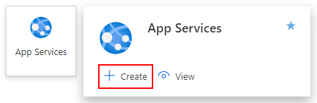
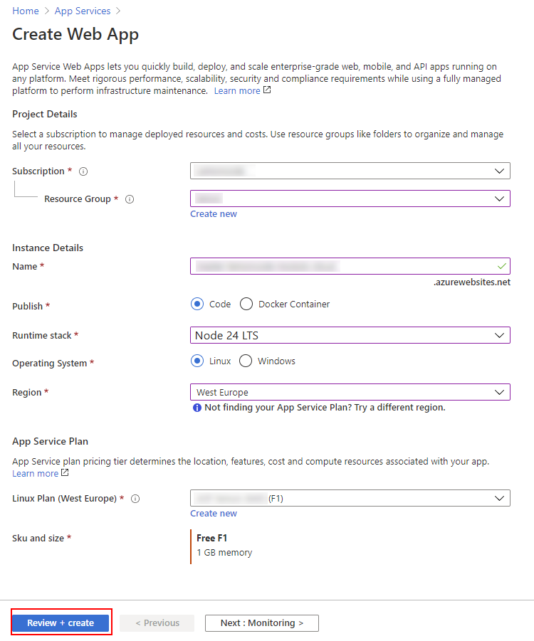
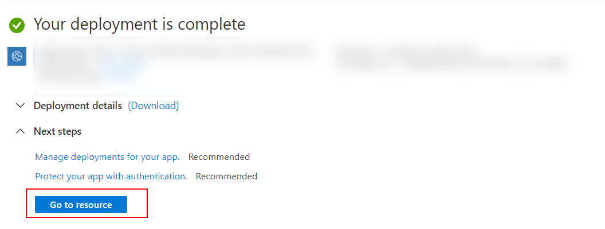
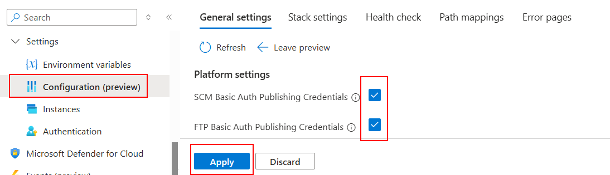
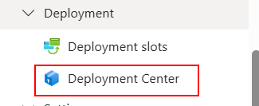
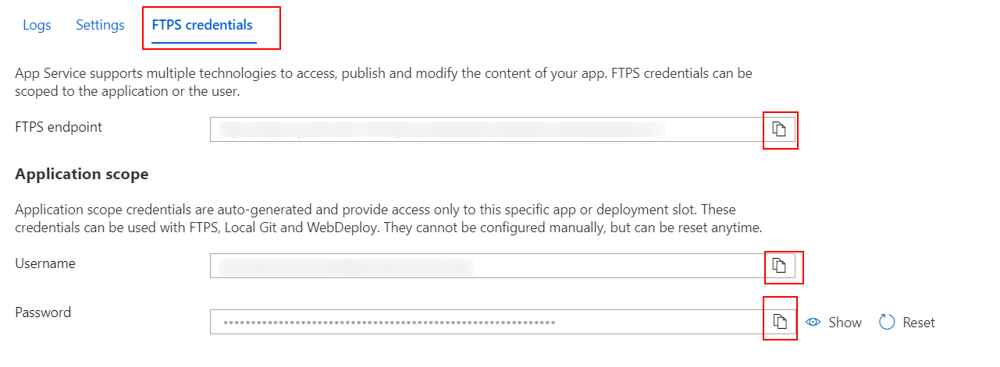
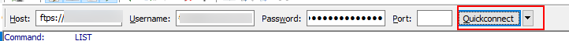
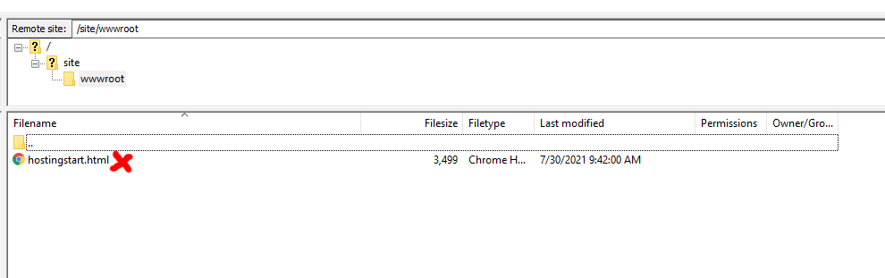
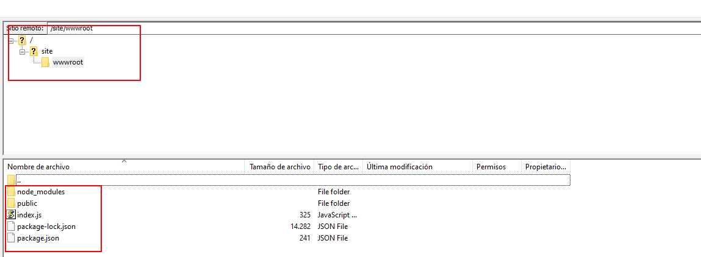
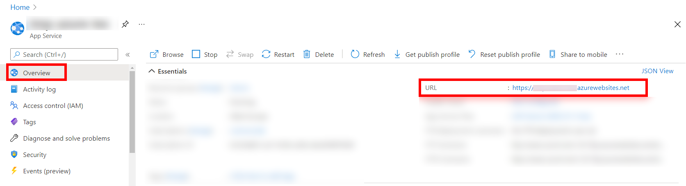

# 02 Azure FTP

En este ejemplo vamos a preparar un servidor de producción encargado de servir nuestra aplicación estática, y lo desplegaremos en un App Service de Azure subiendo los archivos manualmente por FTP.

Partiremos del resultado del ejemplo anterior (`01-bundle-produccion`).

## Paso 1 — Creación del servidor estático con Node.js

Para publicar nuestros archivos en un servidor de producción, necesitamos algún tipo de servidor web que los entregue a los navegadores que los soliciten. En este caso, vamos a utilizar un servidor de `nodejs` ultra rápido y ligero usando el framework **[Hono](https://hono.dev/)**.

Crea una nueva carpeta llamada `server` (puedes crearla al mismo nivel que tu proyecto actual o dentro del mismo espacio de trabajo):

```bash
mkdir server
cd ./server
```

Inicializa el proyecto de Node e instala los paquetes de Hono necesarios:

```bash
npm init -y
npm install hono @hono/node-server -E
```

Para poder usar ES Modules (la sintaxis moderna de `import` que recomienda Hono), necesitamos añadir `"type": "module"` en el archivo `package.json` recién creado. Puedes editarlo para que quede así:

_./server/package.json_

```diff
{
  "name": "server",
  "version": "1.0.0",
- "description": "",
- "main": "index.js",
+ "type": "module",
  "scripts": {
    "test": "echo \"Error: no test specified\" && exit 1"
  },
- "keywords": [],
- "author": "",
- "license": "ISC",
- "type": "commonjs",
  "dependencies": {
    "@hono/node-server": "2.0.1",
    "hono": "4.12.16"
  }
}

```

Ahora, vamos a crear el archivo principal del servidor. Este código simplemente cogerá todos los archivos de una carpeta llamada `public` y los servirá de forma estática gracias al middleware de Hono. Además, redirigirá cualquier ruta no encontrada al `index.html`, algo fundamental para el enrutamiento de las Single Page Applications (SPA):

_./server/index.js_

```javascript
import { serve } from "@hono/node-server";
import { serveStatic } from "@hono/node-server/serve-static";
import { Hono } from "hono";
import fs from "node:fs";
import path from "node:path";

const app = new Hono();

const STATIC_FILES_PATH = "./public";

// Servimos todos los estáticos de la carpeta ./public
app.use("/*", serveStatic({ root: STATIC_FILES_PATH }));

// Redirigimos cualquier ruta directa hacia la raíz (útil por si el usuario recarga en una sub-ruta del front)
app.get("*", (c) => {
  const html = fs.readFileSync(
    path.resolve(STATIC_FILES_PATH, "index.html"),
    "utf-8",
  );
  return c.html(html);
});

const port = process.env.PORT || 8081;

console.log(`App running on http://localhost:${port}`);

serve({
  fetch: app.fetch,
  port,
});
```

## Paso 2 — Configuración y prueba local

Vamos a añadir el script de arranque a nuestro `package.json` para facilitar el levantamiento del servidor:

_./server/package.json_

```diff
...
  "scripts": {
-   "test": "echo \"Error: no test specified\" && exit 1"
+   "start": "node index.js"
  },
```

Antes de ejecutarlo, necesitamos **copiar el contenido de la carpeta `dist`** generada en el paso anterior (nuestro bundle de producción) **dentro de una nueva carpeta llamada `public`** dentro de `/server`. En este punto, la estructura de carpetas dentro de `server` debería verse así:

```text
|server/
|-- node_modules/
|-- public/            <-- Creada manualmente y con los estáticos copiados
|----- assets/
|----- index.html
|-- index.js
|-- package-lock.json
|-- package.json
```

Comprueba que funciona en tu máquina local arrancando el servidor:

```bash
npm start
```

Si accedes a `http://localhost:8081`, deberías ver la aplicación corriendo.

## Paso 3 — Creación del App Service en Azure

Ahora que el servidor está listo, vamos a configurar un servicio web en `Azure` para alojarlo.

1. Entra al portal de Azure y pulsa en crear un **App Service** (o _Web App_).
   

2. Rellena los datos básicos (nombre, grupo de recursos, y asegúrate de elegir el stack de ejecución correcto, por ejemplo **Node** en una versión compatible, SO Linux o Windows según prefieras).
   

3. Una vez se haya desplegado, haz clic en **Go to resource** (Ir al recurso).
   

## Paso 4 — Habilitar y conectar vía FTP

1. Accede a la sección **Configuración** y habilita el acceso FTP asegurándote de permitir FTPS (o al menos FTP básico si estás haciendo pruebas sin datos sensibles).
   

2. En el menú lateral izquierdo, ve a **Deployment Center** (Centro de Implementación).
   

3. Haz clic en la pestaña **FTP** para ver los datos de conexión.
   

4. Utiliza cualquier cliente FTP de escritorio para conectarte. Uno muy recomendable es [FileZilla](https://filezilla-project.org/).
   Copia los valores de `Host`, `Username` (Usuario) y `Password` (Contraseña) en tu cliente FTP y conecta.
   

5. Elimina el archivo por defecto `hostingstart.html` que Azure trae precargado.
   

6. Por último, **sube todos los archivos y carpetas** que tienes dentro de tu directorio `./server` local hacia el servidor remoto.
   

> **Importante:** Al ser un despliegue manual bruto mediante FTP, debes asegurarte de subir la carpeta `node_modules` para que Hono (nuestro servidor de node) funcione en el servidor de destino.

Si todo ha ido bien, al acceder a la URL principal que Azure te muestra en la pantalla de _Overview_ de tu App Service, deberías ver tu aplicación completamente funcional.

