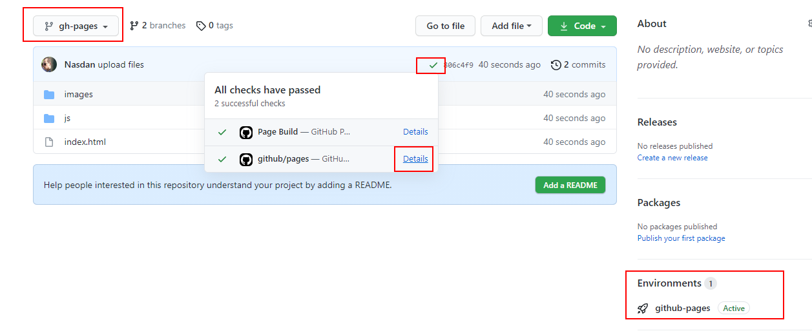

# 03 Github branch

En este ejemplo vamos a desplegar nuestra aplicación estática utilizando [Github Pages](https://pages.github.com/).

Partiremos del resultado del ejemplo anterior (`02-azure-ftp`).

> **Nota:** En este caso no utilizaremos el servidor estático con `Hono` que preparamos en el ejemplo anterior, ya que Github Pages incluye su propio servidor HTTP por debajo para servir los archivos.

## Paso 0 — Instalación y repositorio inicial

Primero, instala las dependencias:

```bash
npm install
```

Para usar Github Pages, necesitamos crear un nuevo repositorio **público** en Github y subir nuestro código base.

```bash
git init
git remote add origin https://github.com/<tu-usuario>/<tu-repositorio>.git
git add .
git commit -m "initial commit"
git push -u origin main
```

## Paso 1 — Despliegue manual en la rama gh-pages

Compilamos nuestro bundle para producción:

```bash
npm run build
```

Genera y cámbiate a una nueva rama llamada `gh-pages` (la convención típica que usa GitHub Pages para saber qué servir):

```bash
git checkout -b gh-pages
```

En esta rama, elimina todo el código fuente y todos los archivos **excepto el contenido de la carpeta `dist`**. Mueve los archivos generados en `dist` a la raíz del repositorio, de modo que en la raíz quede únicamente:

```text
|-- assets/
|-- index.html
```

Sube esta nueva rama a tu repositorio:

```bash
git add .
git commit -m "upload files"
git push -u origin gh-pages
```

> **Verificación:** Ve a la pestaña **Actions** en Github para revisar el proceso interno de Pages. También puedes configurar la rama desde `Settings > Pages`.

Tras unos segundos, tu web estará desplegada en la URL `https://<tu-usuario>.github.io/<nombre-del-repositorio>`:



## Paso 2 — Ajustar el subpath y el Router

Si entras en la URL generada, abrirás la consola de desarrollador y seguramente veas errores 404 de archivos que no cargan:

_https://\<tu-usuario>.github.io/assets/index-a824b72f.js net::ERR_ABORTED 404_

Esto se debe a que, por defecto, Vite empaqueta los assets asumiendo que la web correrá en la raíz del servidor (`/`), pero Github Pages te los aloja habitually en un subdirectorio con el nombre de tu repositorio (`/<nombre-del-repositorio>/`).

Para evitar tener que abrir manualmente el `index.html` y ponerle `./` a cada ruta estática, vamos a decirle a Vite que use siempre rutas relativas en producción.

Vuelve a la rama `main`:

```bash
git checkout main
```

> **Nota:** Como en la rama `gh-pages` borraste todo el código (incluyendo la carpeta `node_modules`), necesitas volver a instalar las dependencias ejecutando `npm install` de nuevo antes de continuar.

Actualiza la configuración de Vite añadiendo la propiedad `base`:

_./vite.config.js_

```diff
...

export default defineConfig({
+ base: './',
  envPrefix: 'PUBLIC_',
  ...
```

> **Referencias:** [Configuración de Base Path público en Vite](https://vitejs.dev/guide/build.html#public-base-path)

Además, dado que no disponemos de un servidor proxy inteligente como Hono o Express para nuestro _enrutamiento Single Page Application_, al refrescar la página manualmente sobre una sub-ruta del repositorio el servidor simple de Github Pages devolverá un error 404 puesto que esa carpeta "física" no existe.

Para mitigar esto, vamos a configurar nuestro router cliente para que use un `hash history` (basado en el `#` en la URL de modo que todas las sub-rutas queden enganchadas al `index.html` principal).

_./src/core/router/router.ts_

```diff
- import { createRouter } from '@tanstack/react-router';
+ import { createRouter, createHashHistory } from '@tanstack/react-router';
// The route-tree file is generated automatically. Do not modify this file manually.
import { routeTree } from './route-tree';

+ const history = createHashHistory();

export const router = createRouter({
  routeTree,
+ history,
});
...

```

Recompila, guardalo, haz el commit y el push en la rama `main`:

```bash
npm run build
git add .
git commit -m "update base path"
git push
```

Finalmente, repite el proceso del paso 1 de subir tu nueva carpeta `dist` actualizada mediante la limpieza a la rama `gh-pages` y comprueba que la página ya es completamente funcional en Producción.

```bash
git checkout gh-pages
# borrar y mover dist...
git add .
git commit -m "update base path"
git push
```
