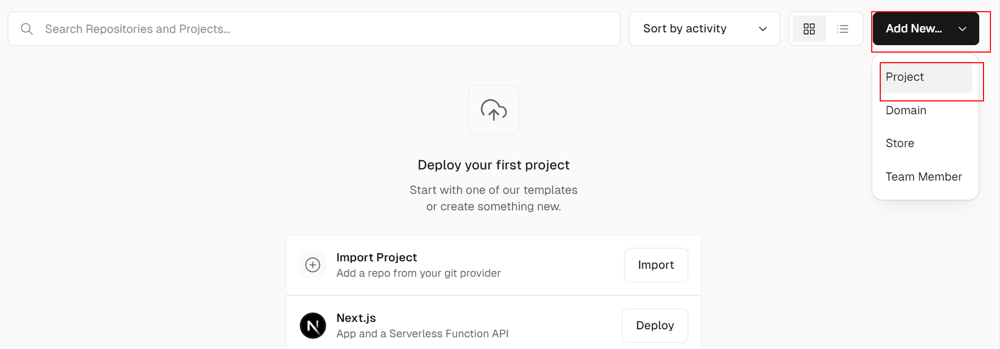
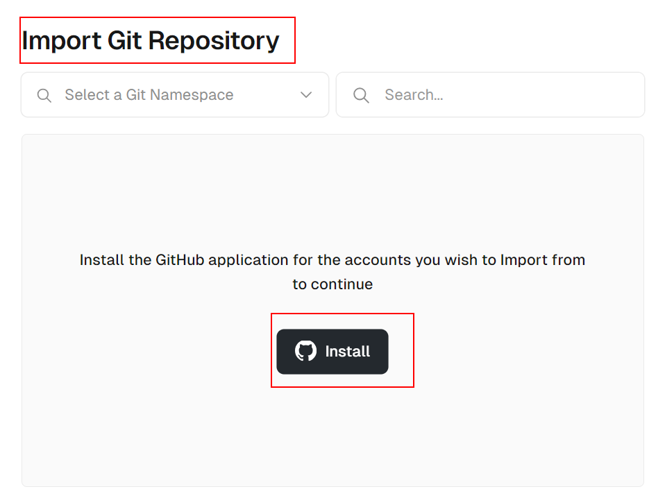
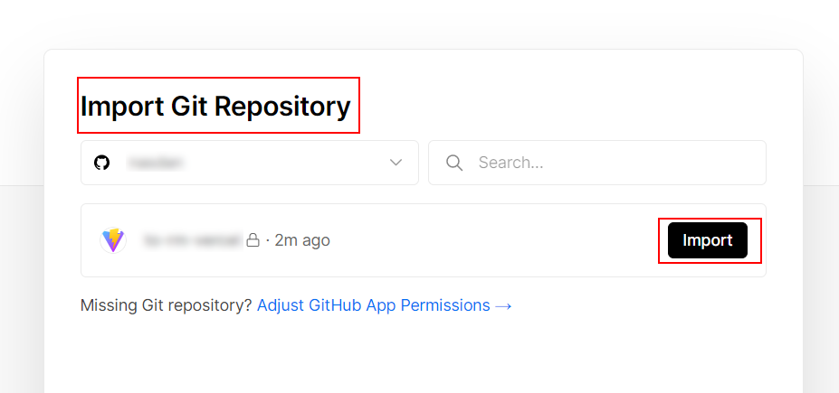
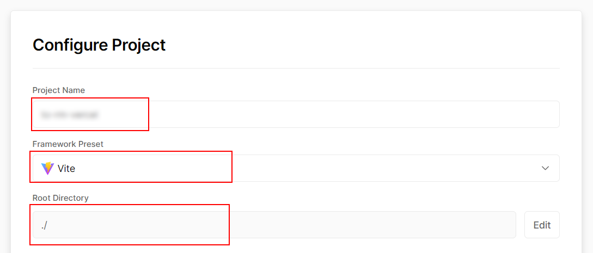
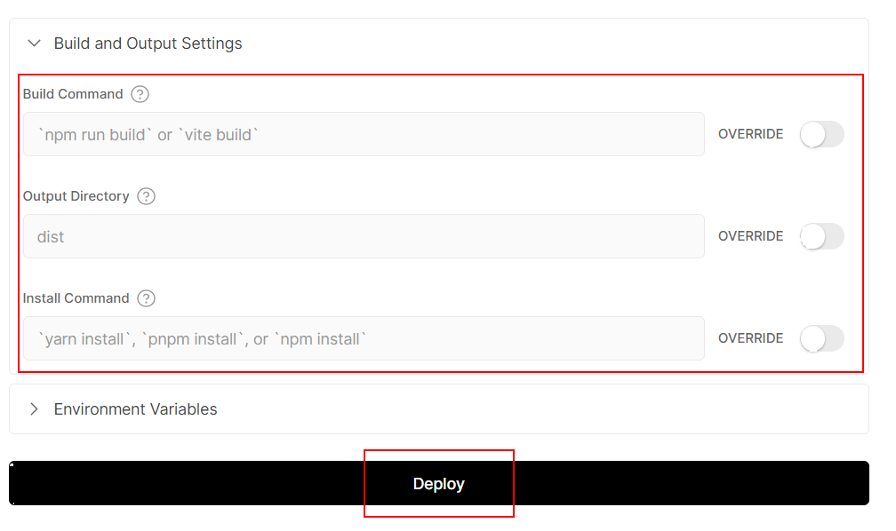

# 04 Vercel Deploy

En este ejemplo vamos a desplegar nuestra aplicación frontend utilizando [Vercel](https://vercel.com/). Vercel es un proveedor cloud optimizado para aplicaciones frontend y frameworks modernos, que permite automatizar los despliegues directamente reaccionando a los cambios en nuestro repositorio de Git.

Partiremos del resultado del ejemplo anterior (`03-github-branch`).

## Paso 0 — Instalación y repositorio inicial

Primero, asegúrate de instalar las dependencias:

```bash
npm install
```

Antes de subir el código, necesitamos preparar los archivos finales que queremos desplegar. Puesto que venimos del ejemplo de Github Pages (donde cambiamos las rutas y el router), vamos a restaurar la configuración original de Vite eliminando la base relativa:

_./vite.config.js_

```diff
import { defineConfig, splitVendorChunkPlugin } from 'vite';
import react from '@vitejs/plugin-react';
import path from 'path';

export default defineConfig({
- base: './',
  envPrefix: 'PUBLIC_',
  ...
```

Y procederemos a restaurar también la configuración original de nuestro router, quitando el `hash history`:

_./src/core/router/router.ts_

```diff
- import { createRouter, createHashHistory } from '@tanstack/react-router';
+ import { createRouter } from '@tanstack/react-router';
// The route-tree file is generated automatically. Do not modify this file manually.
import { routeTree } from './route-tree';

- const history = createHashHistory();

export const router = createRouter({
  routeTree,
- history,
});
...
```

Vercel necesita leer el código desde un repositorio. Crea un nuevo repositorio en Github y sube el código.

> **Nota:** A diferencia de Github Pages, que exige que el repositorio sea público en entornos gratuitos, aquí sí que podemos establecer nuestro repositorio como **Privado** sin ningún problema.


```bash
git init
git remote add origin https://github.com/<tu-usuario>/<tu-repositorio>.git
git add .
git commit -m "initial commit"
git push -u origin main
```

## Paso 1 — Crear la aplicación en Vercel

Una vez subido nuestro código, ve al panel principal de Vercel y crea un nuevo proyecto (_Add New > Project_):



Si es la primera vez, Vercel te pedirá permisos para acceder a tu cuenta de Github. Una vez concedidos, podrás buscar tu repositorio en la lista y pulsar en **Import** (Importar):





## Paso 2 — Configuración y despliegue

Vercel detectará automáticamente que estamos usando **Vite** y preconfigurará los comandos correctos (comando de compilación y directorio de salida). Revisa la configuración básica y simplemente pulsa en **Deploy**:





Tras unos segundos, el proceso de _build_ terminará y nuestra aplicación estará desplegada de forma pública de forma automática. Puedes hacer clic en el dominio generado (normalmente con el formato `https://<nombre-del-proyecto>.vercel.app`) para abrirla en tu navegador.

> **Nota sobre Docker:** A diferencia de otras plataformas PaaS tradicionales, Vercel tiene un enfoque basado en _Serverless_ e infraestructura Edge, enfocada a frontends y funciones ligeras. Por diseño, [Vercel no tiene soporte oficial para correr contenedores Docker estándar de larga duración](https://vercel.com/support/articles/does-vercel-support-docker-deployments).
