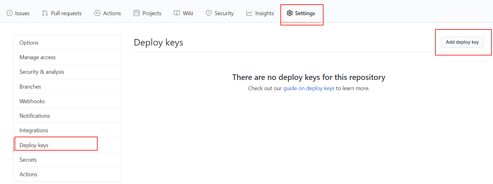
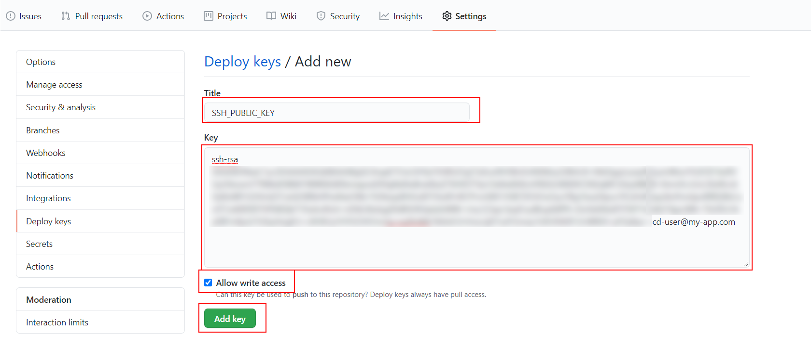
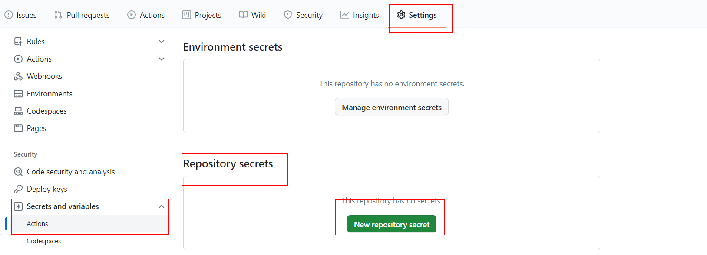
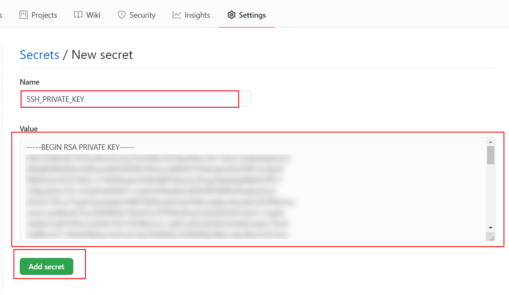
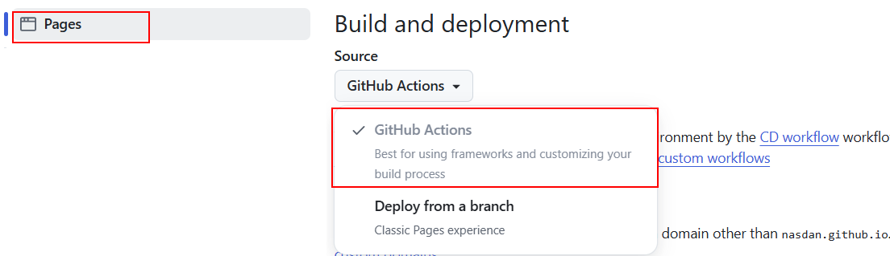

# 01 GitHub Actions

En este ejemplo vamos a automatizar el despliegue a producción de nuestra aplicación para GitHub Pages utilizando GitHub Actions.

Partiremos del código resultante en el ejemplo `03-deploy-manual/03-github-branch`.

## Paso 0 — Instalación y preparación inicial

Primero, instala las dependencias:

```bash
npm install
```

Utilizaremos el mismo destino que en el ejemplo de `gh-pages`, pero utilizaremos [GitHub Actions](https://docs.github.com/es/actions) para desplegar automáticamente al subir cambios.

Crea un nuevo repositorio (público) en GitHub y sube los archivos:

```bash
git init
git remote add origin https://github.com/<tu-usuario>/<tu-repositorio>.git
git add .
git commit -m "initial commit"
git push -u origin main
```

## Paso 1 — Dependencia de despliegue y scripts

Instala [gh-pages](https://github.com/tschaub/gh-pages) como dependencia de desarrollo. Esto nos facilitará subir la carpeta de salida a la rama objetivo de Pages:

```bash
npm install gh-pages --save-dev -E
```

Añade los comandos correspondientes de despliegue en tu `package.json`:

_./package.json_

```diff
  "scripts": {
    "start": "run-p -l type-check:watch start:dev",
    "start:dev": "vite --port 8080",
    "build": "npm run type-check && vite build",
+   "build:dev": "npm run type-check && vite build --mode development",
+   "deploy": "gh-pages -d dist",
    ...
  },
```

La forma manual en local de probarlo sería:

```bash
npm run build:dev
npm run deploy
```

> **Nota:** Este comando manual funciona en tu equipo porque tú tienes acceso a tu propio repositorio y estás logueado en GitHub. ¡Pero GitHub Actions en la nube necesitará tener permisos!

## Paso 2 — Creación del Workflow de Integración/Despliegue Continuo (CI/CD)

Vamos a definir la configuración de Github Actions en nuestro proyecto. Crea un archivo en la ruta `./.github/workflows/cd.yml` en tu repositorio.

_./.github/workflows/cd.yml_

```yml
name: CD workflow

on:
  push:
    branches:
      - main

jobs:
  cd:
    runs-on: ubuntu-latest
    steps:
      - name: Checkout repository
        uses: actions/checkout@v6

      - name: Install
        run: npm ci

      - name: Build
        run: npm run build

      - name: Deploy
        run: npm run deploy
```

Sube los cambios:

```bash
git add .
git commit -m "add continuous deployment"
git push
```

Fíjate en la pestaña de "Actions" de tu repositorio. Verás que el workflow ha **fallado**.
¿Por qué? Porque cada vez que se ejecuta un _job_ de GitHub, se levanta una máquina virtual limpia que no tiene guardadas credenciales para escribir o publicar en tu repositorio mediante comandos gits estándar.

## Paso 3 — Configurar permisos de escritura con claves SSH (Enfoque clásico)

La solución tradicional es permitir a ese _job_ realizar un _git push_. El mejor enfoque es registrar una clave SSH:

1. Ejecuta este comando en tu ordenador para generar la clave (fuera de la carpeta del proyecto para no hacerle commit):

> **¡IMPORTANTE! Si estás en Windows:** Asegúrate de ejecutar este comando concretamente desde la terminal de **Git Bash**. No lo ejecutes en PowerShell ni en CMD, ya que la herramienta ssh-keygen viene integrada con Git.

```bash
ssh-keygen -t ed25519 -C "cd-user@my-app.com"
```

> **Referencias:** Para mayor detalle puedes consultar la [documentación oficial de GitHub sobre la generación de nuevas claves SSH](https://docs.github.com/en/authentication/connecting-to-github-with-ssh/generating-a-new-ssh-key-and-adding-it-to-the-ssh-agent).

Te pedirá 3 cosas:

- Nombre del archivo: `./id_rsa` (asegúrate de incluir el `./` y guardarlo bien para los siguientes pasos, de este modo se generará en este mismo directorio temporalmente).
- Frase de paso (passphrase): Dale a Enter (vacío).
- Confirma frase de paso: Dale a Enter (vacío).

> **Referencias:** Ed25519 es un algoritmo moderno y muy seguro, proporcionando mejor rendimiento frente al clásico RSA.

2. Copia todo el texto de tu clave **Pública** (`id_rsa.pub`) y pégalo en tu repositorio de GitHub: `Settings` > `Deploy keys` > `Add deploy key`. Activa la casilla de **Allow write access**.
   



3. Copia el texto de tu clave **Privada** (la otra, `id_rsa` que NO tiene extensión) en `Settings` > `Security` > `Secrets and variables` > `Actions` > `New repository secret`. Nómbralo `SSH_PRIVATE_KEY`.
   



> **Importante:** Elimina tus claves de tu ordenador una vez copiadas a GitHub, no deben quedar expuestas.

4. Ahora modifica tu script en Actions para que lea este secreto, configures Git y haga el push vía SSH:

_./.github/workflows/cd.yml_

```diff
name: CD workflow

on:
  push:
    branches:
      - main

jobs:
  cd:
    runs-on: ubuntu-latest
    steps:
      - name: Checkout repository
        uses: actions/checkout@v6

+     - name: Use SSH key
+       run: |
+         mkdir -p ~/.ssh/
+         echo "${{secrets.SSH_PRIVATE_KEY}}" > ~/.ssh/id_rsa
+         sudo chmod 600 ~/.ssh/id_rsa

+     - name: Git config
+       run: |
+         git config --global user.email "cd-user@my-app.com"
+         git config --global user.name "cd-user"

      - name: Install
        run: npm ci

      - name: Build
        run: npm run build

      - name: Deploy
-       run: npm run deploy
+       run: npm run deploy -- -r git@github.com:<tu-repositorio-ruta-git>.git

```

> **¡Atención! Uso de URL SSH:** Fíjate muy bien en que en el comando anterior estamos utilizando explícitamente la URL de conexión por **SSH** (`git@github.com:...`) de nuestro repositorio, **EN LUGAR** de la clásica por HTTPS (`https://github.com/...`). Esto es indispensable para que GitHub obligue al _job_ a autenticarse usando la clave SSH que hemos inyectado en los pasos anteriores.

> **Referencias:** Puedes encontrar más información sobre por qué pasamos el parámetro `-- -r` en la [documentación de la opción `repo` del paquete gh-pages](https://github.com/tschaub/gh-pages#optionsrepo).

Guarda y sube el cambio:

```bash
git add .
git commit -m "configure git ssh permits"
git push
```


## Paso 4 — Alternativa moderna: Acción oficial deploy-pages

Como alternativa al paquete `gh-pages` y al jaleo de las claves SSH, GitHub ha lanzado [una acción oficial (`deploy-pages`)](https://github.com/actions/deploy-pages) mucho más fácil de configurar que inyecta automáticamente lo necesario.

1. Primero, en la configuración de Pages del repositorio (`Settings` > `Pages`), asegúrate de cambiar la fuente del Build de _Deploy from a branch_ a **GitHub Actions**:
   

2. Modificamos nuevamente el fichero descartando el script ssh:

_./.github/workflows/cd.yml_

```diff
name: CD workflow

on:
  push:
    branches:
      - main

jobs:
  cd:
    runs-on: ubuntu-latest
+   permissions:
+     pages: write
+     id-token: write
+   environment:
+     name: github-pages
+     url: ${{ steps.deployment.outputs.page_url }}
    steps:
      - name: Checkout repository
        uses: actions/checkout@v6

-     - name: Use SSH key
-       run: |
-         mkdir -p ~/.ssh/
-         echo "${{secrets.SSH_PRIVATE_KEY}}" > ~/.ssh/id_rsa
-         sudo chmod 600 ~/.ssh/id_rsa

-     - name: Git config
-       run: |
-         git config --global user.email "cd-user@my-app.com"
-         git config --global user.name "cd-user"

      - name: Install
        run: npm ci

      - name: Build
        run: npm run build

+     - name: Upload artifact
+       uses: actions/upload-pages-artifact@v5
+       with:
+         path: dist

      - name: Deploy
+       id: deployment
-       run: npm run deploy -- -r git@github.com:<tu-repositorio-ruta-git>.git
+       uses: actions/deploy-pages@v5
```

Aplicamos cambios:

```bash
git add .
git commit -m "using official deploy-pages Github action"
git push
```

> **Anotación:** Usando esta acción ya no necesitas que tu `package.json` tenga instalada la dependencia NPM de `gh-pages`, ni necesitas crear un script `deploy` ni manejar tokens SSH manualmente. Resulta mucho más cómodo y limpio para entornos puramente estáticos.
