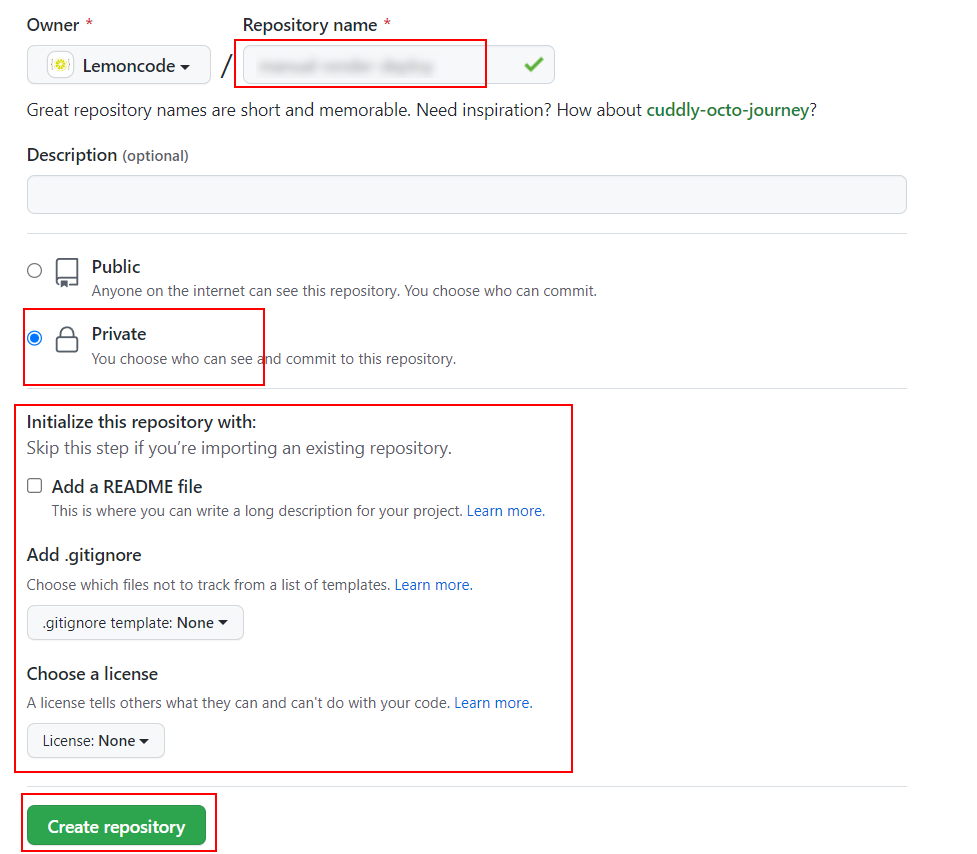
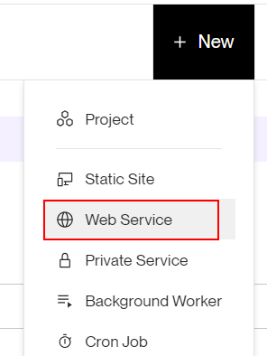
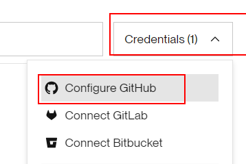
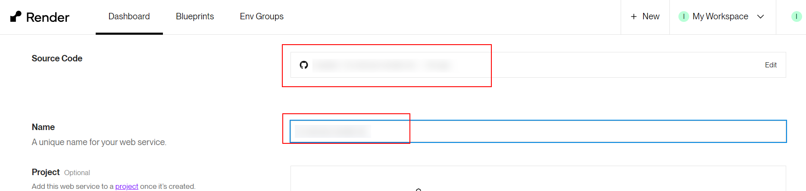
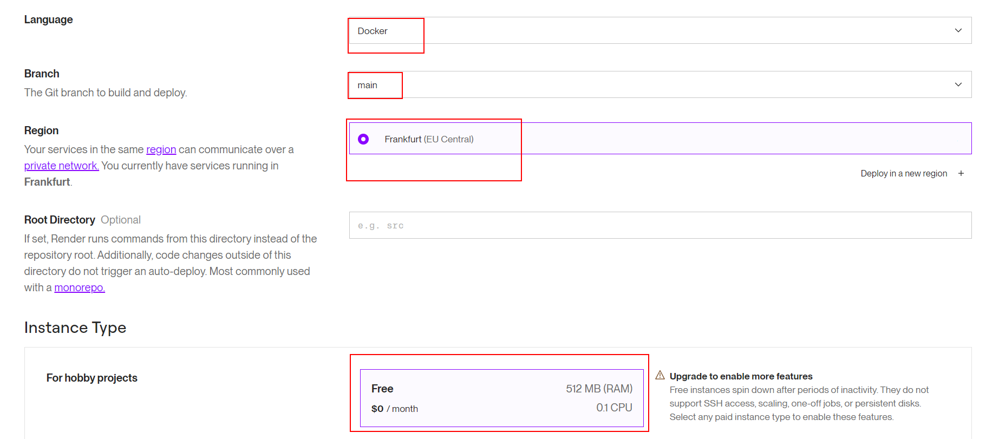
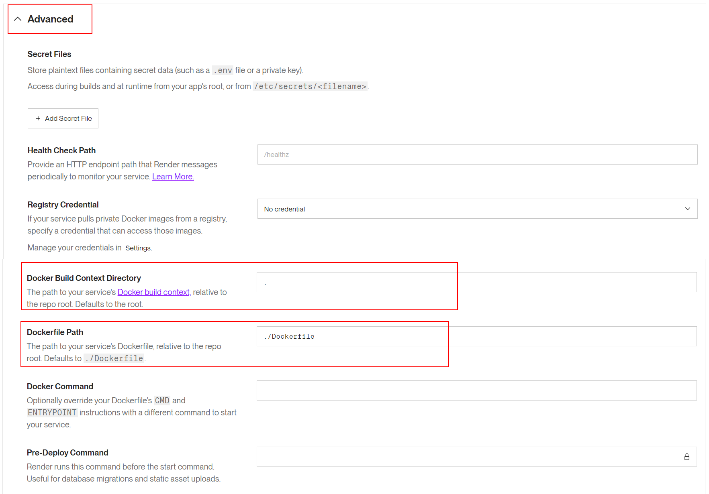

# 03 Deploy a Render (Docker)

En este ejemplo vamos a desplegar de manera automatizada nuestra aplicación usando su imagen de Docker alojándola en **Render**.

Partiremos del código resultante en el ejemplo `05-deploy-docker/02-upload-docker-hub`.

## Paso 1 — Configuración inicial y subida a GitHub

[Render](https://render.com/) es un proveedor de pago por uso e infraestructura en la nube (PaaS) que permite desplegar automáticamente distintos tipos de aplicaciones reaccionando a los cambios en un repositorio Git.

Para que Render nos lea nuestra estructura y construya el `Dockerfile`, primero crea un nuevo repositorio en GitHub y sube los archivos de este proyecto:



```bash
git init
git add .
git commit -m "initial commit"
git remote add origin <tu-repositorio-url>
git push -u origin main
```

## Paso 2 — Enlazando la aplicación en Render

Desde el panel de control de Render, crea una nueva aplicación (Web Service):



Concede permisos a Render para acceder a tu nuevo repositorio de GitHub:



Configura el entorno de ejecución, es crucial especificar que el proyecto arranca mediante Docker marcando la opción de Runtime apropiada:





## Paso 3 — Configuración Avanzada

En los "Advanced settings" podemos comprobar la ruta al archivo `Dockerfile` y el "Docker Build Context" (la carpeta desde donde se ejecuta el build). Aunque nuestra app ya está en la raíz y usará los valores por defecto (normalmente `.` o `./`), siempre es buena práctica verificar que Render esté apuntando correctamente al directorio base de tu repositorio.

En caso de requerir personalizaciones adicionales u ocultar variables de entorno (Secretos), también los definiremos en esta misma sección antes de lanzar el deploy:



Hacemos clic en el botón `Deploy Web Service` para lanzar la compilación de la imagen en los servidores de Render. Observarás los logs del Dockerfile en la propia consola de la web.

Una vez el despliegue es exitoso, podrás abrir la web usando la URL final: `https://<app-name>.onrender.com`.

> **Sobre la gestión de puertos en Render:**
> Render (al igual que Azure u otros PaaS) inyecta por detrás una variable de entorno `PORT` en el contenedor cuando arranca (habitualmente el puerto 10000 u otro interno), encargándose de enrutar el tráfico HTTP/HTTPS externo hacia él. Esto hace que codificar rígidamente un puerto mediante `ENV PORT=8080` dentro de nuestro `Dockerfile` sea un paso redundante o incluso contraproducente para ciertos proveedores.
> Podemos simplificarlo de la siguiente manera:

_./Dockerfile_

```diff
...

- ENV PORT=8080
CMD ["node", "index.js"]

```

# About Basefactor + Lemoncode

We are an innovating team of Javascript experts, passionate about turning your ideas into robust products.

[Basefactor, consultancy by Lemoncode](http://www.basefactor.com) provides consultancy and coaching services.

[Lemoncode](http://lemoncode.net/services/en/#en-home) provides training services.

For the LATAM/Spanish audience we are running an Online Front End Master degree, more info: http://lemoncode.net/master-frontend
