# 04 Deploy Manual en Azure (Docker)

En este ejemplo vamos a automatizar el despliegue de nuestra imagen de Docker alojándola en un App Service de **Azure** utilizando GitHub Actions y GitHub Container Registry.

Partiremos del código resultante en el ejemplo `05-deploy-docker/03-deploy-render`.

## Paso 1 — Configuración inicial y subida a GitHub

Para que GitHub Actions pueda ejecutar procesos de CI/CD (Integración y Despliegue Continuos), primero necesitamos alojar nuestro código en un repositorio de GitHub.

Crea un nuevo repositorio en tu cuenta y sube los archivos de este proyecto:


```bash
git init
git remote add origin <tu-repositorio-url>
git add .
git commit -m "initial commit"
git push -u origin main
```

## Paso 2 — Creación de la Web App en Azure

Desde el portal de Azure, vamos a crear una nueva aplicación pensada para alojar contenedores:

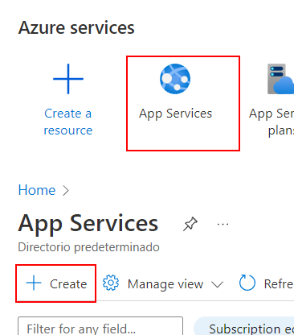

Configuramos los detalles de la instancia (asegurándonos de seleccionar "Container" como método de publicación y Linux como sistema operativo):

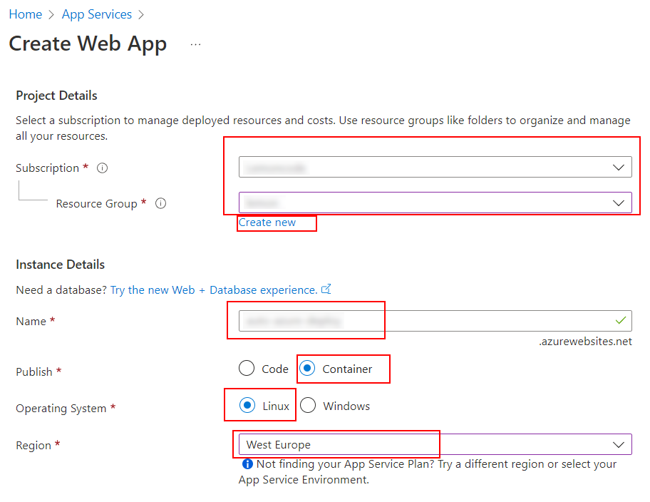

Por motivos de pruebas, seleccionamos un plan de precios gratuito (Free F1) o el más básico disponible:

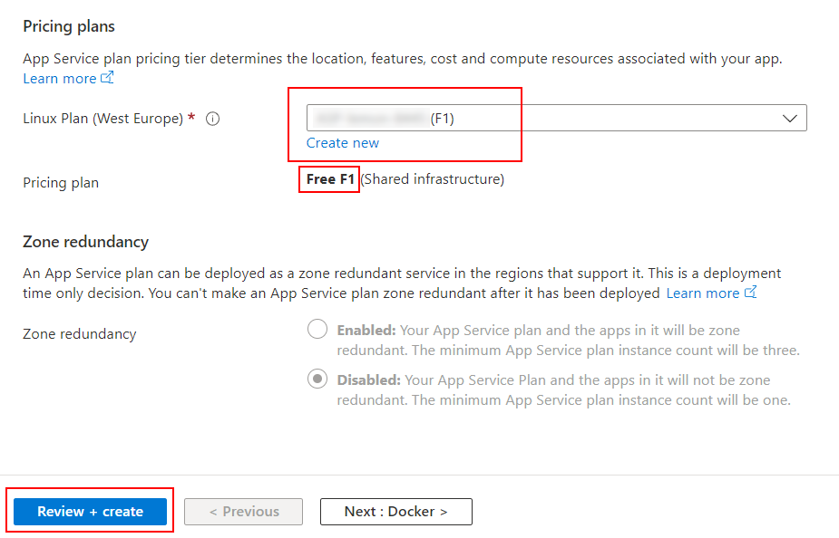

Revisamos las configuraciones y creamos el recurso:

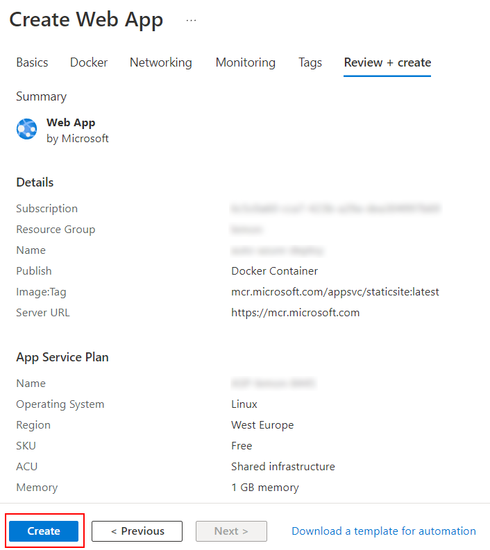

Por defecto, la aplicación intentará arrancar empleando una imagen de demostración de Microsoft. Para inyectarle la nuestra, pasaremos a la sección de configuración usando variables de entorno que apuntarán hacia nuestro futuro repositorio de Docker.

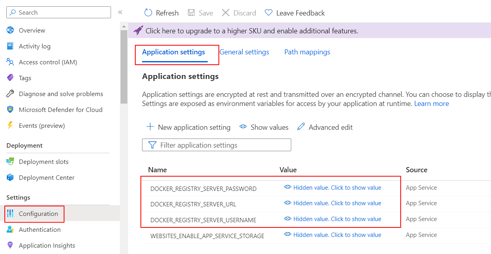

> 📚 [Lectura extra oficial: Despliegue de Docker a Azure App Service](https://docs.github.com/en/actions/deployment/deploying-to-your-cloud-provider/deploying-to-azure/deploying-docker-to-azure-app-service)

## Paso 3 — Preparando GitHub Container Registry (GHCR)

Aunque podríamos recurrir al Docker Hub público que configuramos en los ejemplos anteriores, GitHub Container Registry ([GHCR](https://docs.github.com/en/packages/working-with-a-github-packages-registry/working-with-the-container-registry)) es una fantástica alternativa integrada dentro de la propia plataforma de GitHub que nos permitirá tener imágenes privadas vinculadas directamente a nuestro repositorio de código.

Para conceder a Azure permisos de lectura en nuestro registro privado de GitHub, necesitamos crear un Token de Acceso Personal (PAT) en GitHub.

> **Nota técnica:** Actualmente debemos generar un token del tipo **Classic**, ya que la API no soporta completamente interactuar con registros empleando los nuevos tokens "_Fine-grained_" (hay [un issue abierto respecto al futuro plan del roadmap de GitHub](https://github.com/github/roadmap/issues/558) al respecto).

En GitHub ve a las opciones (Settings) de tu perfil y entra en "Developer settings":

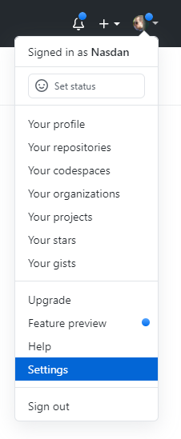

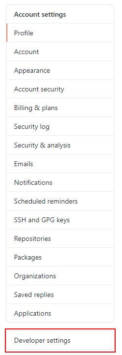

Crea el nuevo token tradicional (Tokens classic):

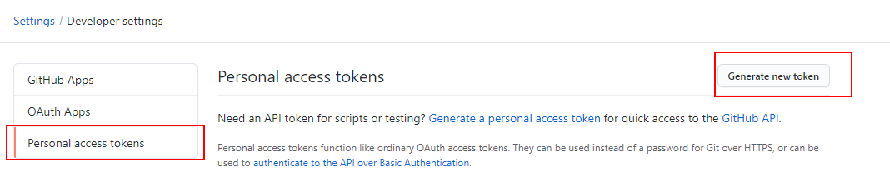

Asigna un nombre para identificar su uso y su caducidad según lo estimes oportuno:

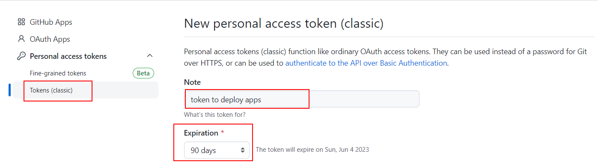

Es de **extrema importancia** marcar únicamente las casillas de acceso para el código del repositorio (`repo`) y para la lectura de paquetes (`read:packages`).

> **¿Por qué solo permisos de lectura?** Este token se lo entregaremos en exclusiva a Azure, que solo necesita permisos para **descargar (pull)** nuestra imagen privada. La compilación y subida de nuevas imágenes al registro (`write:packages`) la orquestaremos más adelante directamente dentro de GitHub Actions, el cual usará su propio token interno automático y temporal.

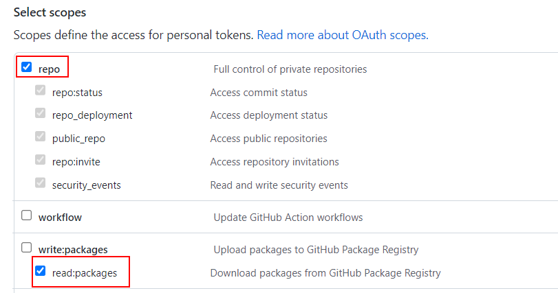

Guarda y **copia el token generado** (solo te lo mostrará esta vez).

Vuelve al portal de Azure, sitúate sobre las variables de entorno (_Environment variables / Configuration_) que dejamos en el Paso 2 y aliméntalo con estos 3 parámetros para autenticarte frente al registro de GitHub:

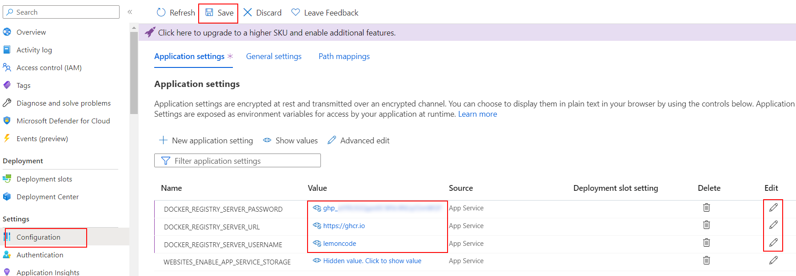

> - `DOCKER_REGISTRY_SERVER_URL`: `https://ghcr.io`
> - `DOCKER_REGISTRY_SERVER_USERNAME`: Usa tu nombre de cuenta de GitHub o de la organización.
> - `DOCKER_REGISTRY_SERVER_PASSWORD`: El valor del token (PAT) copiado enteramente.

## Paso 4 — Construyendo y desplegando con GitHub Actions

Ahora la verdadera magia: Le vamos a decir a GitHub de forma asíncrona que cada vez que subamos código construya nuestra imagen, la suba a su gestor GHCR y despierte a Azure para que coja la nueva versión.

Lo haremos a través un flujo `CD Workflow` definiéndolo en YAML:
_./.github/workflows/cd.yml_

```yml
name: CD Workflow

on:
  push:
    branches:
      - main

env:
  IMAGE_NAME: ghcr.io/${{github.repository}}:${{github.run_number}}-${{github.run_attempt}}

permissions:
  contents: "read"
  packages: "write"
```

> **Anotaciones de código:**
>
> - `github.repository`: El nombre del repositorio y usuario de GitHub. (Ej. `lemoncoders/my-app`). Importante: si tu usuario o repo tiene mayúsculas **debes ponerlo internamente en minúsculas** o el etiquetado del _tag_ fallará dando error de `--tag invalid reference format`.
> - Usamos los contextos dinámicos `github.run_number` y `github.run_attempt` para concatenar automáticamente identificadores (tags) únicos por cada despliegue que realizamos, preservando el histórico y evitando sobreescribir la misma etiqueta sin querer.

Anexamos dentro del mismo fichero los trabajos del Action propiamente explícitos:

_./.github/workflows/cd.yml_

```diff
...
permissions:
  contents: 'read'
  packages: 'write'

+ jobs:
+   cd:
+     runs-on: ubuntu-latest
+     steps:
+       - name: Checkout repository
+         uses: actions/checkout@v6
+
+       - name: Log in to GitHub container registry
+         uses: docker/login-action@v4
+         with:
+           registry: ghcr.io
+           username: ${{ github.actor }}
+           password: ${{ secrets.GITHUB_TOKEN }}
+
+       - name: Build and push docker image
+         run: |
+           docker build -t ${{env.IMAGE_NAME}} .
+           docker push ${{env.IMAGE_NAME}}
+
+       - name: Deploy to Azure Web App
+         uses: azure/webapps-deploy@v3
+         with:
+           app-name: ${{ secrets.AZURE_APP_NAME }}
+           publish-profile: ${{ secrets.AZURE_PUBLISH_PROFILE }}
+           images: ${{env.IMAGE_NAME}}

```

> **Autenticación encriptada (`GITHUB_TOKEN`):** No hace falta configurar un PAT en los secretos para poder subir a Github Registry; al darle permisos de _packages write_ previamente, GitHub de manera intrínseca autoriza al workflow usando la env `${{ secrets.GITHUB_TOKEN }}`.

Para que las dos últimas claves `AZURE_APP_NAME` y `AZURE_PUBLISH_PROFILE` resuelvan con los valores reales, ve a tu repositorio de GitHub > Settings > Secrets and variables > Actions > New repository secret, y crea ambos secretos:


**1. `AZURE_APP_NAME`**: El nombre con el que bautizaste la app en Azure.

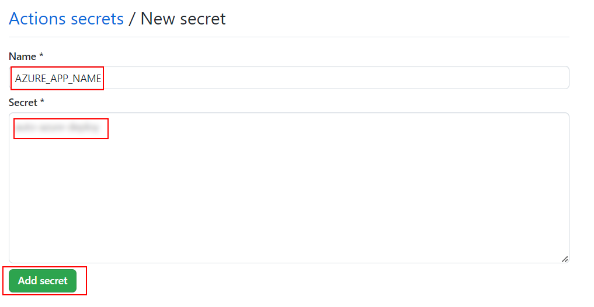

**2. `AZURE_PUBLISH_PROFILE`**: Este es el archivo de control en XML que permite a terceros inyectar comandos o imágenes contra el servidor remoto usando la API. Descárgalo desde Overview (si lo permite) o Deployment Center en Azure. Si recibes alertas para "habilitar la autenticación básica sCM", hazlo primero.

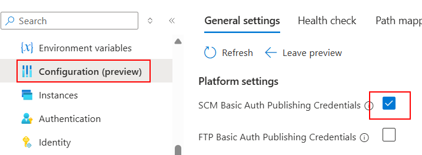

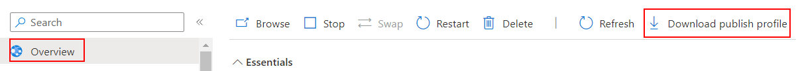

Abre el archivo `.PublishSettings` con VSCode o el bloc de notas, copia **todo el contenido estructurado en XML** y pégalo como el valor clave de `AZURE_PUBLISH_PROFILE`.

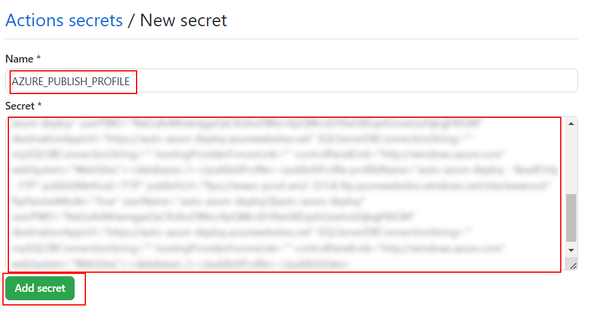

Guarda todo el proceso y lánzalo contra el repositorio remoto para que reaccione (Action):

```bash
git add .
git commit -m "create github workflow"
git push
```

Una vez observemos (en color verde) desde la pestaña "Actions" del repositorio web que el despliegue es exitoso, podemos abrir la url definitiva de la aplicación: `https://<app-name>.azurewebsites.net`.

# About Basefactor + Lemoncode

We are an innovating team of Javascript experts, passionate about turning your ideas into robust products.

[Basefactor, consultancy by Lemoncode](http://www.basefactor.com) provides consultancy and coaching services.

[Lemoncode](http://lemoncode.net/services/en/#en-home) provides training services.

For the LATAM/Spanish audience we are running an Online Front End Master degree, more info: http://lemoncode.net/master-frontend
