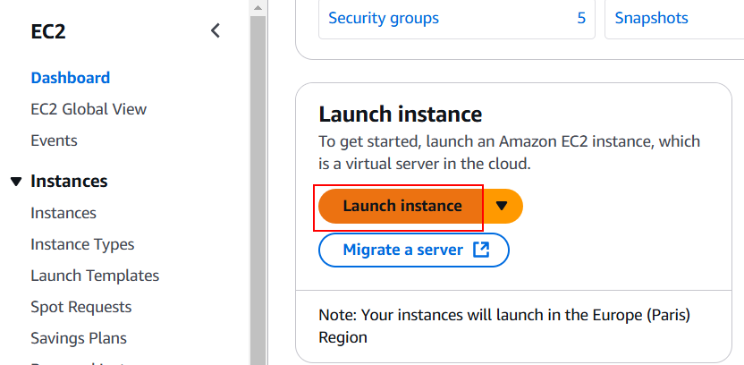
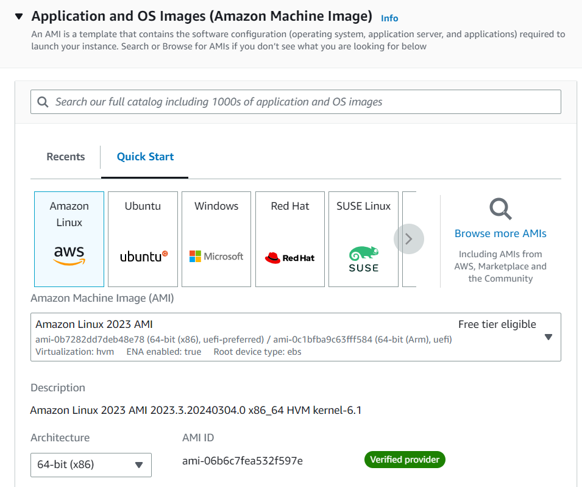
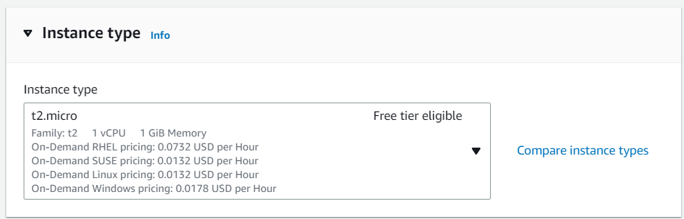
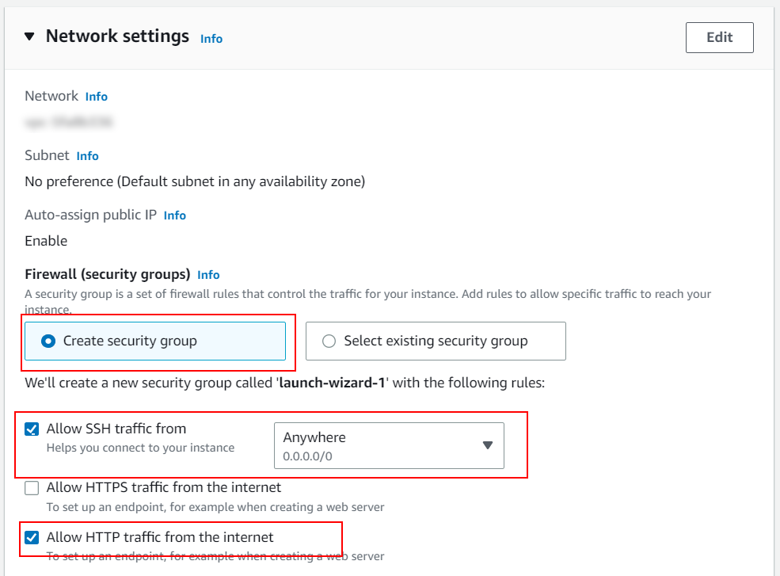
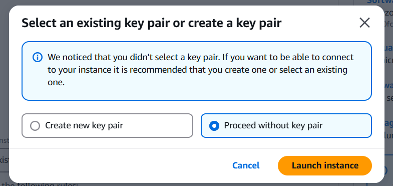
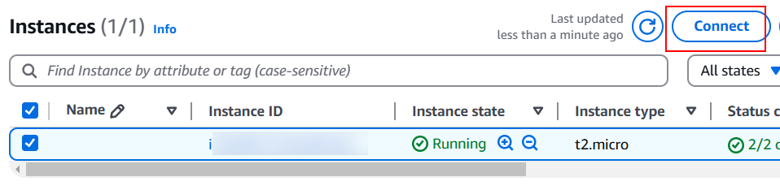
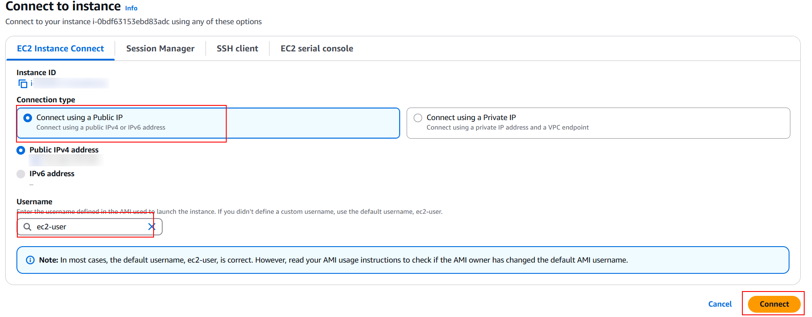

# 05 Deploy Manual en AWS (Docker)

En este ejemplo vamos a desplegar nuestra aplicación en **Amazon Web Services (AWS)** utilizando una máquina virtual básica (EC2) donde instalaremos Docker y ejecutaremos nuestra imagen de forma manual.

Partiremos de la imagen subida a Docker Hub en el ejemplo `05-deploy-docker/02-upload-docker-hub`.

## Paso 1 — Creación de la instancia en Amazon EC2

[Amazon EC2](https://aws.amazon.com/es/ec2/) (Elastic Compute Cloud) nos proporciona capacidad informática escalable en la nube de AWS, es decir, máquinas virtuales donde podemos ejecutar nuestras propias aplicaciones.

Comencemos creando una nueva instancia EC2 desde la consola de AWS:



1. **Nombre y sistema operativo (AMI):** Le damos un nombre a nuestra máquina y seleccionamos _Amazon Linux_ como sistema operativo, el cual está optimizado para funcionar en este entorno.



2. **Tipo de instancia:** Seleccionamos `t2.micro` (o similar que esté dentro de la capa gratuita "Free tier").



3. **Configuración de red (Security Group):** Necesitamos habilitar el tráfico de red de entrada para que nuestra página sea accesible desde internet. Habilitamos tanto el tráfico HTTP (puerto 80) como el HTTPS (puerto 443).



Haz clic en el botón `Launch instance` (Lanzar instancia). Te pedirá seleccionar o crear un par de claves (_Key pair_) de seguridad. Para este ejercicio básico, donde nos conectaremos directamente por la consola web de AWS (sin usar cliente SSH local), puedes seleccionar `Proceed without a key pair` (Continuar sin un par de claves):



## Paso 2 — Conexión e instalación manual de Docker

Una vez que el estado de la instancia pase a _Running_, la seleccionamos y hacemos clic en el botón conectar (`Connect`):



Usaremos **EC2 Instance Connect** para abrir una terminal directamente desde nuestro navegador web:



Ya estamos dentro de nuestra máquina virtual en la nube. ¡Pero está completamente virgen! Necesitamos actualizar el sistema operativo e instalar Docker manualmente:

```bash
# Actualizamos el gestor de paquetes de Amazon Linux
sudo yum update -y

# Instalamos Docker
sudo yum install docker -y

# Arrancamos el servicio/demonio de Docker
sudo service docker start

# (Opcional) Añadimos nuestro usuario al grupo de docker para no tener que usar sudo constantemente
sudo usermod -a -G docker ec2-user
```

> 📚 [Lectura extra oficial: Instalación de Docker en Amazon EC2](https://docs.aws.amazon.com/AmazonECS/latest/developerguide/create-container-image.html)

## Paso 3 — Ejecución remota de la imagen pública

Nuestra máquina en AWS ya tiene el motor de contenedores listo. Ahora simplemente le pedimos a Docker que ejecute la imagen que habíamos subido a nuestro registro público de Docker Hub en el tutorial _02_.

Al igual que comprobamos en nuestra máquina local, al no encontrar la imagen en AWS, Docker la descargará automáticamente (_pull_). Mapearemos el puerto público de internet `80` (el puerto por defecto para la navegación HTTP) de nuestra máquina EC2 al puerto interno `8083` de nuestro contenedor (donde configuramos que escuche el servidor Hono):

```bash
sudo docker run --name my-app-container --rm -d -p 80:8083 <tu-usuario-de-dockerhub>/my-app:3
```

> **Recordatorio (Arquitecturas cruzadas):** Si construiste la imagen en una máquina Apple Silicon (M1/M2/M3), AWS EC2 (que usa x86) no logrará ejecutarla al tener distinta arquitectura u arrojará un _warning_. De ser así, deberás empaquetar tu imagen en tu PC previamente usando el flag `docker build --platform linux/amd64 ...` e indicar `--platform linux/amd64` también en este `run`.

¡Despliegue finalizado! Para ver el resultado abre en tu navegador la DNS Pública o IP de la instancia de EC2 proporcionada en su panel: `http://<ec2-instance-dns>.<region>.compute.amazonaws.com` (recuerda usar obligatoriamente el protocolo `http://` normal y NO el seguro `https://`, ya que no le hemos montado un certificado SSL).

# About Basefactor + Lemoncode

We are an innovating team of Javascript experts, passionate about turning your ideas into robust products.

[Basefactor, consultancy by Lemoncode](http://www.basefactor.com) provides consultancy and coaching services.

[Lemoncode](http://lemoncode.net/services/en/#en-home) provides training services.

For the LATAM/Spanish audience we are running an Online Front End Master degree, more info: http://lemoncode.net/master-frontend
