# Deploy Aplicación Node.js + MongoDB

En este ejercicio vamos a desplegar una aplicación completa (frontend + backend) en Render que requiere persistencia utilizando una base de datos externa.

Para comenzar, crea una nueva carpeta donde trabajarás y copia dentro todo el contenido de la carpeta `01-inicio`. Todo el trabajo lo realizaremos dentro de esta nueva carpeta.

## Paso 1 — Escribiendo nuestro Dockerfile (Multi-stage Build)

Dado que tenemos frontend y backend, utilizaremos **Multi-stage builds** en nuestro archivo `Dockerfile` en el directorio raíz de la carpeta en la que estás trabajando. Esto nos permite tener varias fases y producir un contenedor de producción muy ligero. Definimos primero una etapa base para no repetir el directorio de trabajo y la imagen inicial.

### Fase 0: Imagen Base e Inicialización

_./Dockerfile_

```Dockerfile
FROM node:24-alpine AS base
RUN mkdir -p /usr/app
WORKDIR /usr/app
```

### Fase 1: Build del Frontend

Vamos a usar la imagen base para compilar la aplicación React construida con Vite:

_./Dockerfile_

```diff
FROM node:24-alpine AS base
RUN mkdir -p /usr/app
WORKDIR /usr/app

+ # Compilamos frontend
+ FROM base AS build-frontend
+ COPY frontend/package*.json ./
+ RUN npm ci
+ COPY ./frontend ./
+ RUN npm run build
```

### Fase 2: Build del Backend

Ahora, definiremos una segunda fase para compilar el backend con Vite también:

_./Dockerfile_

```diff
FROM node:24-alpine AS base
RUN mkdir -p /usr/app
WORKDIR /usr/app

# Compilamos frontend
FROM base AS build-frontend
COPY frontend/package*.json ./
RUN npm ci
COPY ./frontend ./
RUN npm run build

+ # Compilamos backend
+ FROM base AS build-backend
+ COPY backend/package*.json ./
+ RUN npm ci
+ COPY ./backend ./
+ RUN npm run build
```

### Fase 3: Producción

En esta última fase generaremos la imagen ligera final. Solo copiaremos los estáticos compilados del frontend (a la carpeta `/public` que espera el backend) y el código compilado del backend:

_./Dockerfile_

```diff
...

+ # Release final (lo que realmente necesitamos subir)
+ FROM base AS release
+ COPY backend/package*.json ./
+ RUN npm ci --omit=dev
+ ENV STATIC_FILES_PATH=./public
+ COPY --from=build-frontend /usr/app/dist ${STATIC_FILES_PATH}
+ COPY --from=build-backend /usr/app/dist ./

+ CMD [ "node", "index.js" ]
```

⚠️ No olvides crear también tu fichero `.dockerignore`:

_./.dockerignore_

```
.github
node_modules
dist
.gitignore
.prettierrc
.env
```

## Paso 2: Crear base de datos en MongoDB Atlas

Desplegaremos MongoDB en este caso en [MongoDB Atlas](https://www.mongodb.com/cloud/atlas), el sitio oficial en la nube.

Podemos empezar con un clúster gratuito:

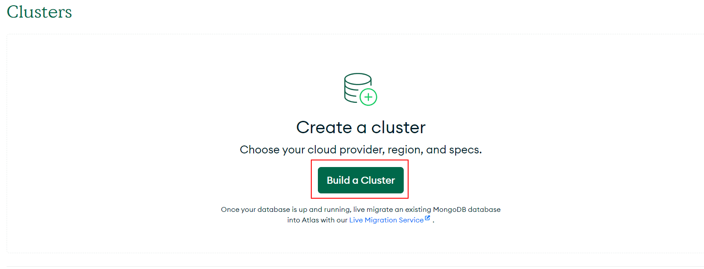

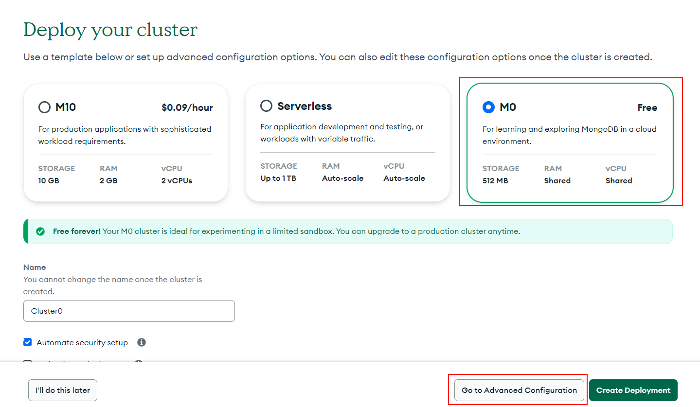

Podemos elegir entre tres proveedores y diferentes regiones:

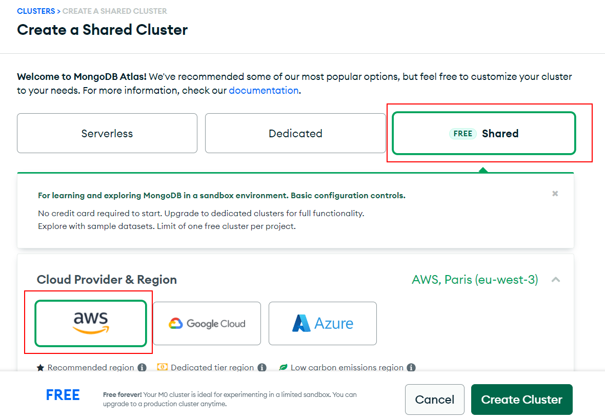

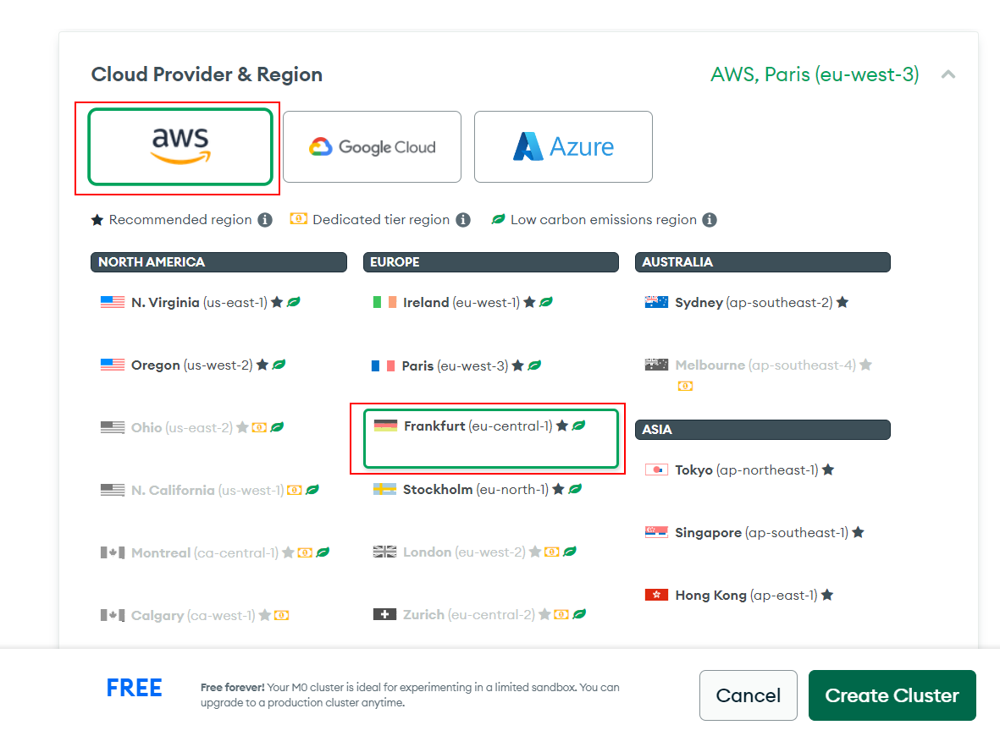

Finalmente, dale un nombre (si quieres) y crea el clúster:

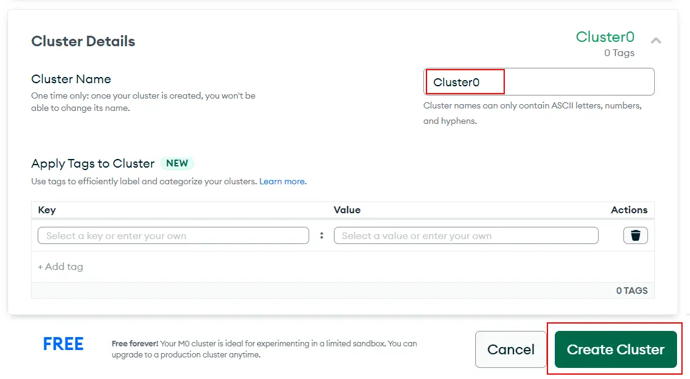

Después de crear el clúster, veremos la guía de inicio rápido pero navegaremos a la página de clústeres:

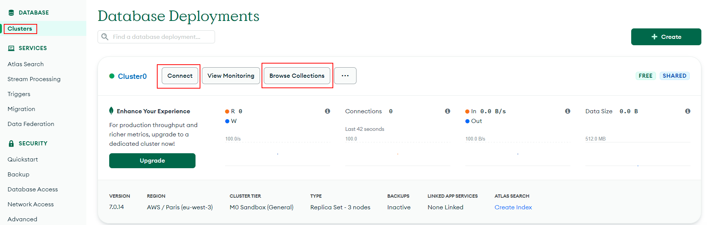

Vamos a configurar el acceso a la base de datos, añadiendo un nuevo usuario:

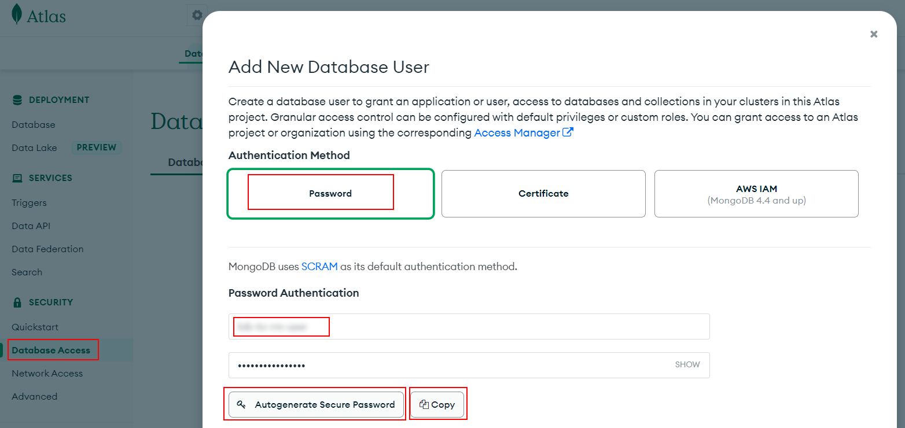

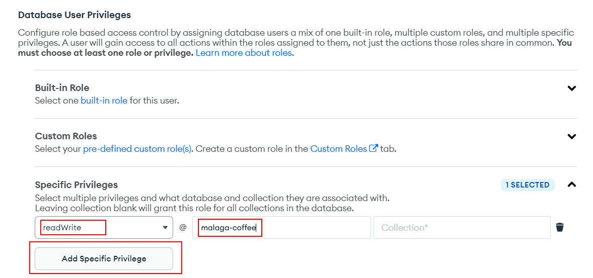

Por defecto, MongoDB Atlas solo permite el acceso a IPs configuradas, vamos a añadir una nueva regla para permitir todas las IPs:

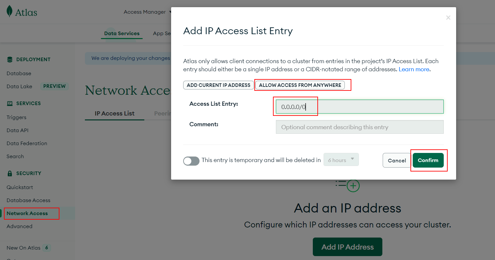

> Copiemos la contraseña autogenerada. La utilizaremos en la cadena de conexión de MongoDB (MongoDB Connection URI).
>
> Añade privilegios de usuario de BD usando privilegios específicos.

Copiemos la cadena de conexión (`MongoDB Connection URI`):

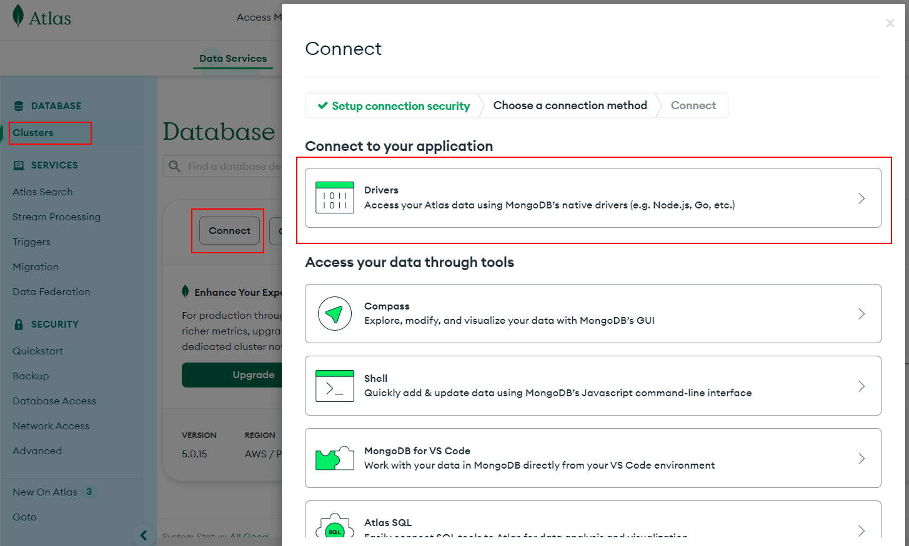

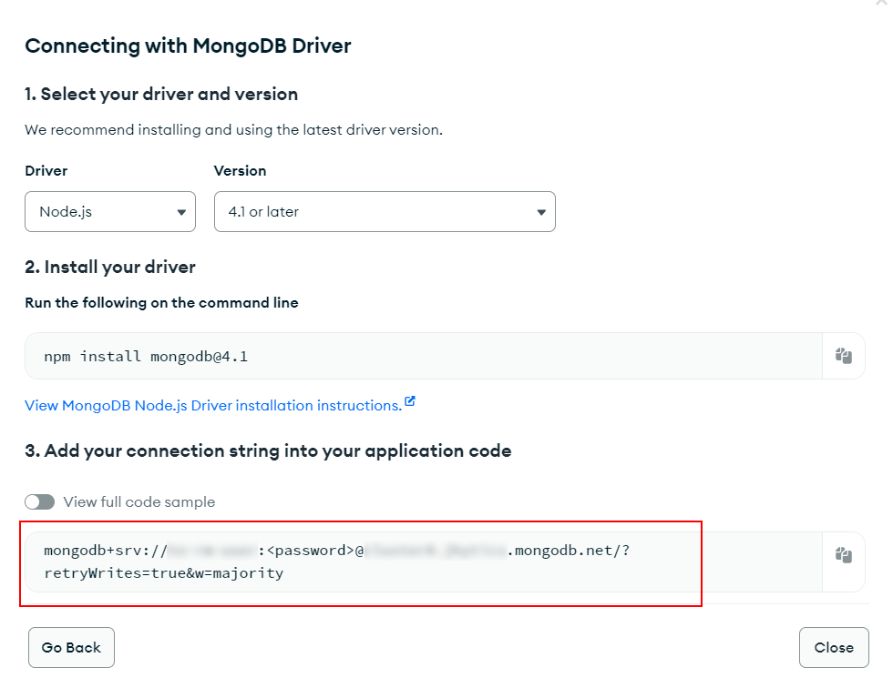

> Reemplaza `<password>` por la contraseña que has copiado antes y ojo que falta el `<dbname>` detras del server `.net/<dbname>?appName=`.

## Paso 3: Desplegar la aplicación web en Render

Por último, utilizaremos Render para montar el contenedor de nuestra app y darle salida a internet.

1. Crea un nuevo repositorio en tu cuenta de GitHub.
2. Inicializa el repositorio local, añade los archivos y haz el primer commit y push de tu código (incluyendo el `Dockerfile` y `.dockerignore`) ejecutando los siguientes comandos en tu terminal:

```bash
git init
git add .
git commit -m "Initial commit"
git branch -M main
git remote add origin <tu-repositorio-de-github>
git push -u origin main
```

3. Accede a tu cuenta de [Render](https://render.com/).
4. Haz clic en **New** y selecciona **Web Service**.
5. Conecta el repositorio de GitHub que acabas de crear. Si los ficheros están en la raíz del repositorio, no necesitarás configurar ninguna ruta base especial.
6. Render detectará automáticamente que el entorno de ejecución es **Docker** (Environment: Docker) gracias a la presencia de tu fichero `Dockerfile`.
7. En el apartado de **Environment Variables (Variables de entorno)**, añade la variable de entorno para tu conexión a Mongo (generalmente `MONGO_URI`) y pon como valor la cadena de conexión completa de MongoDB Atlas (reemplazando `<usuario>` y `<password>`).
8. Haz clic en **Create Web Service** y espera a que termine el despliegue.

¡Listo! Ya tienes una aplicación Full Stack (Backend Node con Vite + Frontend React + MongoDB Cloud) desplegada desde un único contenedor en producción en la nube.
