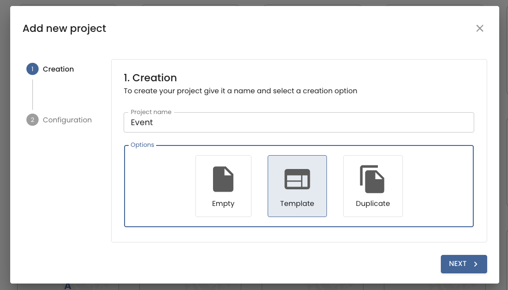
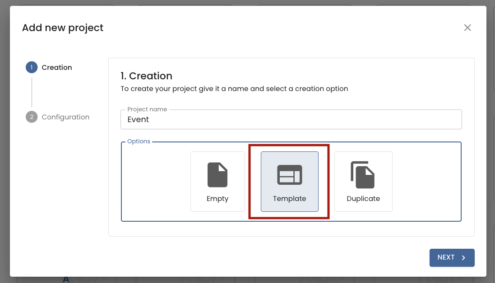
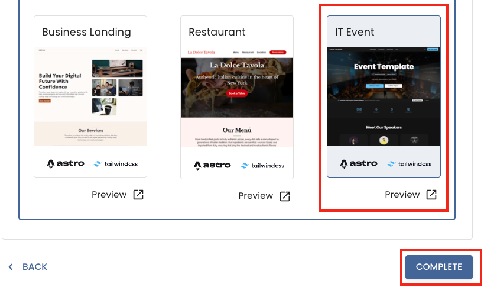
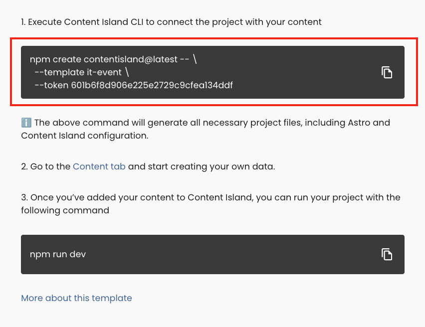
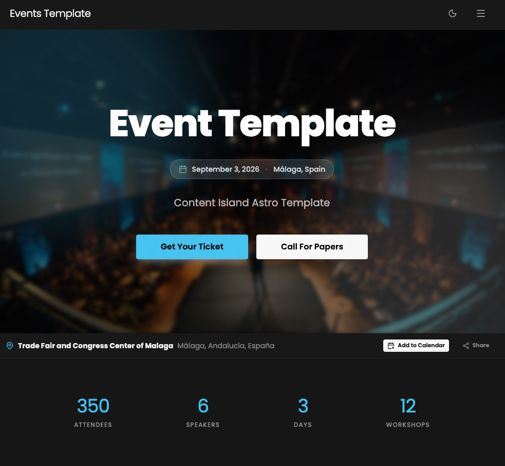
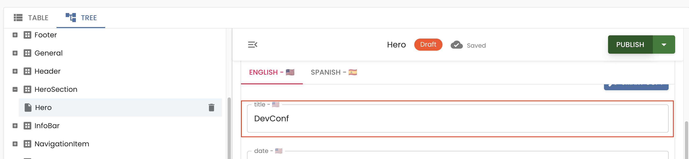
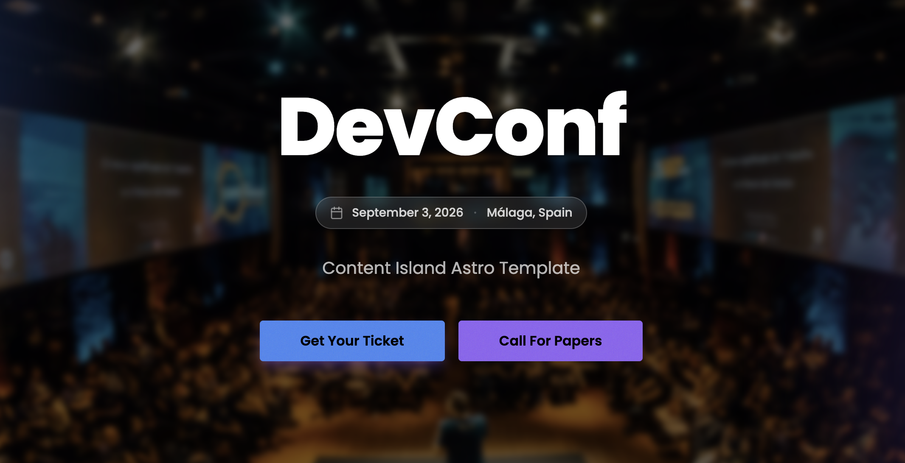

En esta sección vamos a configurar un webhook para que cada vez que hagamos un push a nuestro repositorio, se despliegue automáticamente la aplicación en Vercel. Para ello, vamos a ir a Content Island, vamos a crear un nuevo proyecot a partir de la plantilla de It-Event, y una vez creado, vamos a ir a la sección de **Webhooks** dentro de la configuración del proyecto.

# Paso 1 — Creación del repositorio

Vamos a crear un nuevo repositorio en GitHub y una vez creado, vamos a clonar el repositorio en nuestra máquina local.

```bash
git clone
cd <nombre-del-repositorio>
```

# Paso 2 — Creación del proyecto con la plantilla de It-Event

¿Qué es Content Island? Content Island es una plataforma de gestión de contenido (CMS) que nos permite crear y gestionar nuestro contenido de forma sencilla. Además, nos ofrece una API para poder consumir ese contenido desde nuestra aplicación.

Vamos a ir a [Content Island](https://contentisland.net/en/), creamos una cuenta si aún no la tenemos, y vamos a seguir los siguientes pasos para crear un nuevo proyecto a partir de la plantilla de It-Event:

1. **Crea un proyecto en blanco** en Content Island (`Add Project`).



2. **Elige "Start from a template"**.



3. Selecciona la plantilla **IT Event**.



4. En el último paso (**Quick Start**), copia el comando de la CLI y ejecútalo en tu terminal.



5. Arranca el servidor local:

```bash
npm run dev
```

Una vez que el servidor esté arrancado, abre tu navegador y ve a `http://localhost:4321` para ver la aplicación en funcionamiento.

Vamos a subir este proyecto a nuestro repositorio de GitHub. Para ello, añadimos los archivos al staging area, hacemos un commit y subimos los cambios a GitHub:

```bash
git add .
git commit -m "feat: add it-event template"
git push main
```

# Paso 3 - Despliegue en Vercel

Navegamos a [Vercel](https://vercel.com/). En caso de que no tengas cuenta, puedes crear una gratuita.

Pinchamos en `Add New...` → `Project`.


Si es la primera vez que usas Vercel, te pedirá que elijas la plataforma donde tienes tus repositorios, ya sea GitHub, Bitbucket o GitLab.


Seleccionamos nuestra cuenta.


Si es la primera vez que integramos GitHub con Vercel, tendremos que darle permiso. Le indicamos únicamente el repositorio con el que vamos a trabajar (`mi-sitio`). Es buena idea, por seguridad, no darle permiso a todos los repositorios, sino solo a los que vayamos a usar.


Instalamos.


Y confirmamos nuestra contraseña.


Aquí ya tenemos nuestro sitio. Ahora pinchamos en `Import`.


Vercel detecta automáticamente que es un proyecto de Astro y nos preconfigura los comandos de build y la carpeta de salida. También podemos configurarlo si necesitamos hacer algún ajuste.

IMPORTANTE: En nuestro caso necesitamos configurar la variable de entorno `CONTENT_ISLAND_ACCESS_TOKEN` con la API Key que hemos generado en Content Island para que Vercel pueda acceder a nuestro contenido.

Nos vamos a nuestro proyecto en Content Island y copiamos el valor de nuestro token.


Y lo añadimos como variable en Vercel. **Ojo**: no compartas este token con nadie.


Y pinchamos en `Deploy`.


Si esperamos un momento, nuestro sitio estará desplegado.


Le damos a `Continue to Dashboard`.


Y aquí podemos ver que se ha generado nuestro dominio.


Si pinchamos sobre la imagen del proyecto, ya estamos live. En mi caso, con un dominio del tipo `.vercel.app`.



También puedes tener un dominio personalizado, en este post del propio [Vercel](https://vercel.com/docs/domains/working-with-domains/add-a-domain) te explican cómo hacerlo.

# Paso 4 - Configurando el webhook en Content Island

Todo genial, pero... queremos que cuando publiquemos nuevos posts estos se vean reflejados automáticamente en nuestro sitio web.

Para ello, vamos a configurar un webhook que permita a Content Island notificar a Vercel que debe lanzar un nuevo despliegue cuando se publique contenido.

**¿Qué es un webhook?** Un webhook es una URL a la que se pueden enviar peticiones HTTP para notificar que ha ocurrido un evento. En nuestro caso, el evento será la publicación de un nuevo post en Content Island, y la URL del webhook será la que nos proporcione Vercel para lanzar un nuevo despliegue.

Nos vamos a los settings del proyecto de Vercel.


Elegimos `Git` en el sidebar.


En `Deploy Hook`, le damos un nombre al webhook (por ejemplo, Content Island Deploy), seleccionamos la rama (`main`) y pulsamos sobre `Create Hook`.


Esto nos dará una URL de webhook.


Ahora vamos al proyecto de Content Island y, en la pestaña de webhooks, creamos uno nuevo de Vercel.


Le damos un nombre, pegamos la URL del webhook y guardamos.


Volvemos y comprobamos que se ha creado correctamente.


A partir de ahora, cada vez que publiquemos nuevas entradas en Content Island, se lanzará automáticamente un nuevo despliegue en Vercel y nuestro sitio web se actualizará con el contenido más reciente.

## Probando el webhook

Vamos a hacer una prueba...

Cambiamos el título de un post y lo publicamos.



Si vamos a la pestaña de Deployments en Vercel, veremos cómo se ha lanzado un nuevo despliegue automáticamente.


Si esperamos un poco puedes ver que el sitio se ha actualizado con el nuevo título del post.


Si vamos a vercel vemos que se ha actualizado la web.



Y a partir de ahora, solo tienes que preocuparte de crear buen contenido en Content Island. El resto se hace solo.
